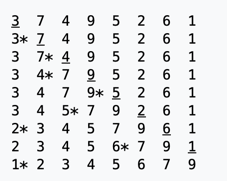

1. Expliquer comment on benchmark du code (avec System.nanoTime())
	- voir diapositive 59 du diaporama 5
```text
1 implémenter l’algorithme en Java ou dans un autre langage
2 tester l’algorithme sur des données de tailles différentes
ex.: trier des listes de 50, 100, 150, 200, ... éléments
3 mesurer la différence de temps entre le début et la fin de l’exécution
4 comparer graphiquement les résultats
```

2. Implanter (ou montrer avec ChatGPT) un tri par sélection, un tri par insertion et un tri à bulles et benchmarker les 
résultat pour différentes valeurs de N. 
Afficher le résultat graphiquement (avec gnuplot ou autre).

- [Tri par sélection/selection sort](https://en.wikipedia.org/wiki/Selection_sort)
```java
arr[] = 64 25 12 22 11

// Find the minimum element in arr[0...4]
// and place it at beginning
11 25 12 22 64

// Find the minimum element in arr[1...4]
// and place it at beginning of arr[1...4]
11 12 25 22 64

// Find the minimum element in arr[2...4]
// and place it at beginning of arr[2...4]
11 12 22 25 64

// Find the minimum element in arr[3...4]
// and place it at beginning of arr[3...4]
11 12 22 25 64 
```
Exemple avec [SelectionSort](https://chat.openai.com/share/3ac4fdb3-5518-4289-9a8b-778788aa699f)

- [Tri par insertion/insertion sort](https://en.wikipedia.org/wiki/Insertion_sort)

À chaque étape, la clé considérée est soulignée. 
La clé qui a été déplacée (ou laissée en place car elle était la plus grande jamais prise en compte) 
à l'étape précédente est marquée d'un astérisque.



- [Tri à bulles/Bubble sort](https://en.wikipedia.org/wiki/Bubble_sort)

3. Benchmarker aussi un QuickSort (generer avec ChatGPT) avec un cas random vs pire cas.
random quick sort: 587 0497, 137 5113, 131 2483
worst case quick sort: 589 1287, 528 8067, 571 0038
4. Regarder le javadoc de Arrays pour voir la liste des méthodes intéressants
https://docs.oracle.com/en/java/javase/11/docs/api/java.base/java/util/Arrays.html

Regarder le de code Arrays.sort() dans l'OpenJDK et pointer qu'il utilise DualPivotQuicksort
https://github.com/openjdk/jdk11/blob/37115c8ea4aff13a8148ee2b8832b20888a5d880/src/java.base/share/classes/java/util/Arrays.java#L170

Voici le code:
https://github.com/openjdk/jdk11/blob/37115c8ea4aff13a8148ee2b8832b20888a5d880/src/java.base/share/classes/java/util/DualPivotQuicksort.java#L102
Il est interessant de voir que le code decide d'utiliser différents versions de tri selon les caracteristiques de l'entrée

NB: l'objectif n'est pas du tout de connaitre profondement les detailles de l'implementation de tri en Java ou l'algorithme dual pivot quicksort. C'est plutot de demystifier le code de la librairie standard.