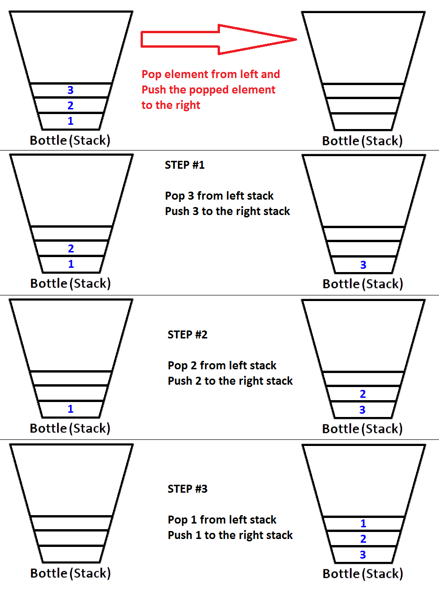

# 4. Implémentez une File d'attente (Queue) en utilisant deux Piles
   (servez-vous de l'implémentation `Stack` de la librairie de
   collections)

S'il y a N éléments dans votre File, combien d'opérations sont
requises pour ajouter un nouvel élément ?

```text
Lorsque vous ajoutez un nouvel élément (enQueue), vous devez effectuer une opération qui consiste à pousser le nouvel 
élément dans la pile1. Par conséquent, le nombre d’opérations pour ajouter un nouvel élément est O(1), indépendant du 
nombre d’éléments, N. Quel que soit le nombre d'éléments dans la file d'attente, la complexité temporelle de l'opération 
d'ajout est constante.
```

Considérez l'ordre O(...) en fonction du nombre d'éléments N tel que
vu en classe

```text
Chaque retrait de la file d'attente nécessite le déplacement d'éléments de la pile1 vers la pile2, ce qui nécessite N opérations.

Par conséquent, la complexité temporelle de l’opération de retrait de la file d’attente est O(N)
```


# 5. Adaptez le code de la liste chaînée pour en faire une ListeCirculaire

Une liste circulaire fonctionne similairement à une liste chaînée, à
la différence que le n.prochain du "dernier" noeud de la liste
circulaire == le "premier" noeud de la liste

* 1. Transformer la classe ListeChainee pour utiliser des types paramétrés plutôt que des int

* 2. Modifier la classe ListeChainee pour lancer une IndexOutOfBoundsException lorsqu'on tente d'accéder à un index qui dépasse la longueur de la liste. Discuter des avantages de cette version.


Une liste circulaire a un "premier" mais ne stocke pas de référence
vers le dernier :


       +-----------------+
       |                 |
       | ListeCirculaire .
       |                 |\
       +-----------------+ \ premier
                            \
                             \
                              V
                              +-------+       +--------+        +--------+
                              |   1   |       |    2   |        |    3   |
                        +---> |       +------>|        |------->|        |
                        |     +-------+       +--------+        +--------+
                        |                                            |
                        |                                            |
                        |                                            |
                        +--------------------------------------------+

Aucun noeud ne devrait avoir de `prochain = null`

a) Faites une première version de ListeCirculaire qui contient
   toujours ces 3 noeuds : 1, 2 et 3 (comme dans le diagramme
   précédent). Créez ces trois noeuds dans le constructeur
   directement.

Ne vous souciez pas de addFirst(), addLast() et size() pour le moment.


Ajoutez une méthode :

    public void print(int n) {
        // ...
    }

Qui affiche les valeurs de n noeuds à partir du premier sur la console

Pour le moment, le code :

     liste.print(5);

Devrait afficher :

    1
    2
    3
    1
    2


b) Faites fonctionner la méthode size(). Attention aux boucles
infinies...


c) Retirez les trois noeuds 1, 2 et 3 du constructeur et modifiez les
   méthodes addFirst() et addLast() pour les faire fonctionner avec le
   concept de liste circulaire


d) Analysez le nombre d'opérations nécessaires pour exécuter
   addFirst() et addLast() dans votre ListeCirculaire en fonction du
   nombre d'éléments N dans la liste

Donnez votre réponse selon l'ordre de grandeur en fonction de N avec
la notation vue en classe : O(...)
```text
addFirst() O(1)
addLast() O(N) (besoin de trouver la fin de la liste en traversant la liste)
```


e) Trouvez une façon d'améliorer la performance de la méthode
   liste.get(i)

Pour la liste contenant [1, 2, 3], on devrait pouvoir utiliser :

    System.out.println(liste.get(0)); // => 1
    System.out.println(liste.get(3)); // => 1
    System.out.println(liste.get(33)); // => 1
    System.out.println(liste.get(34)); // => 2
    System.out.println(liste.get(35)); // => 3


Quel est l'ordre de grandeur du nombre d'opérations pour accéder à
l'élément #i en fonction du nombre d'éléments N dans la liste ?
Utilisez la notation O(...)
9
```
reponse : O(N), parce que la méthode get(i) doit parcourir la liste pour trouver l'élément i (i opérations)
```
